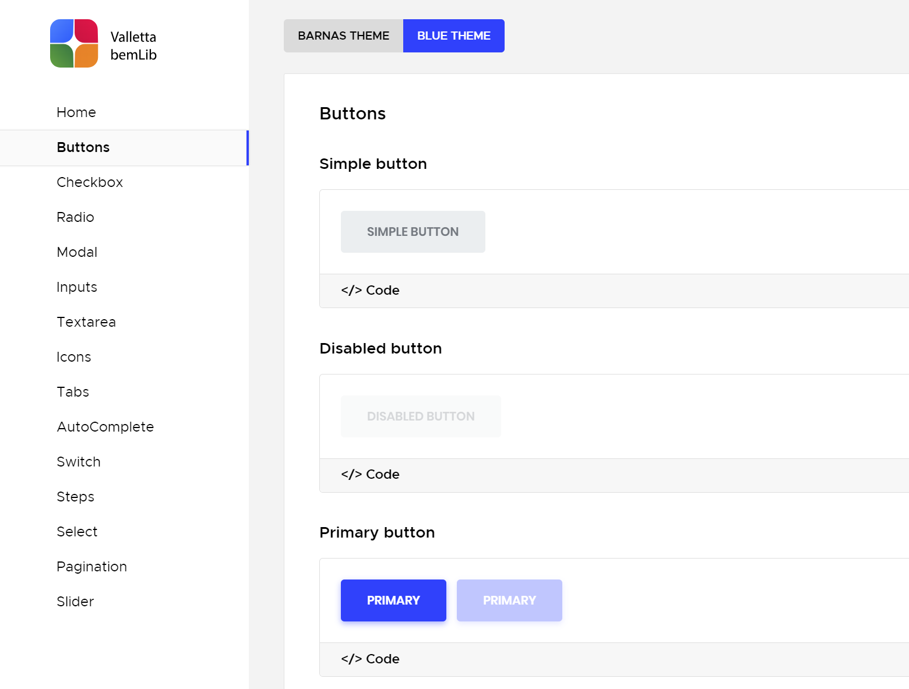

# BEM UI library

## Setup

Download or clone repo.

Run `npm install` in the project root folder to install dependencies

## Available Scripts

In the project directory, you can run:

### `npm run start`

Runs the app in the development mode.

Open [http://localhost:3000](http://localhost:3000) to view it in your browser.

### `npm run build`

Builds the app for production to the `build` folder.

## Technologies

## Project features

- BEM methodology
- SASS
- React
- React Router
